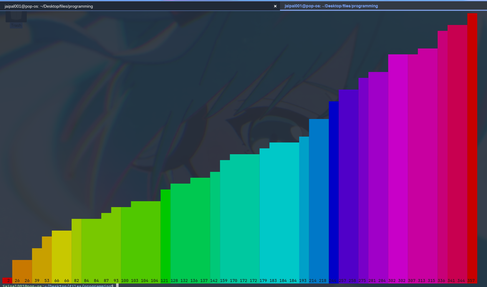
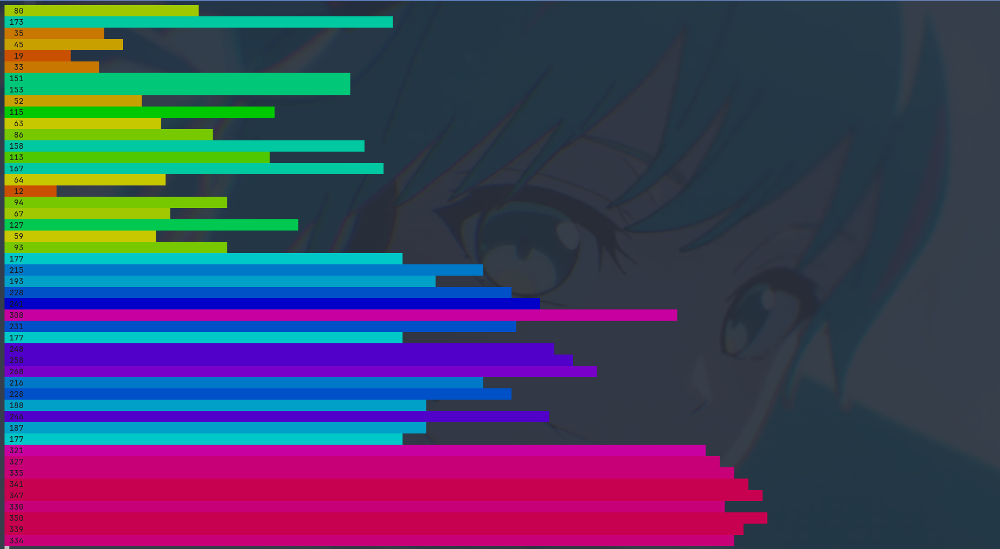
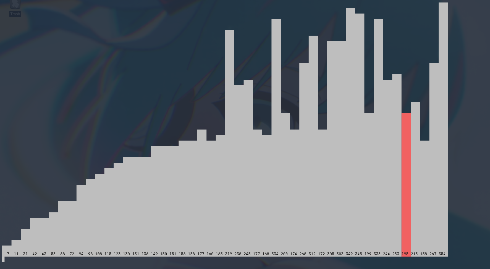
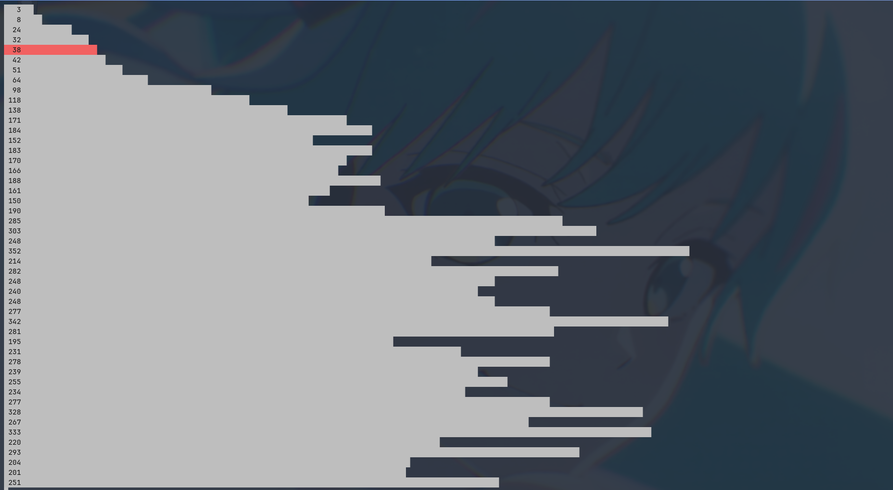
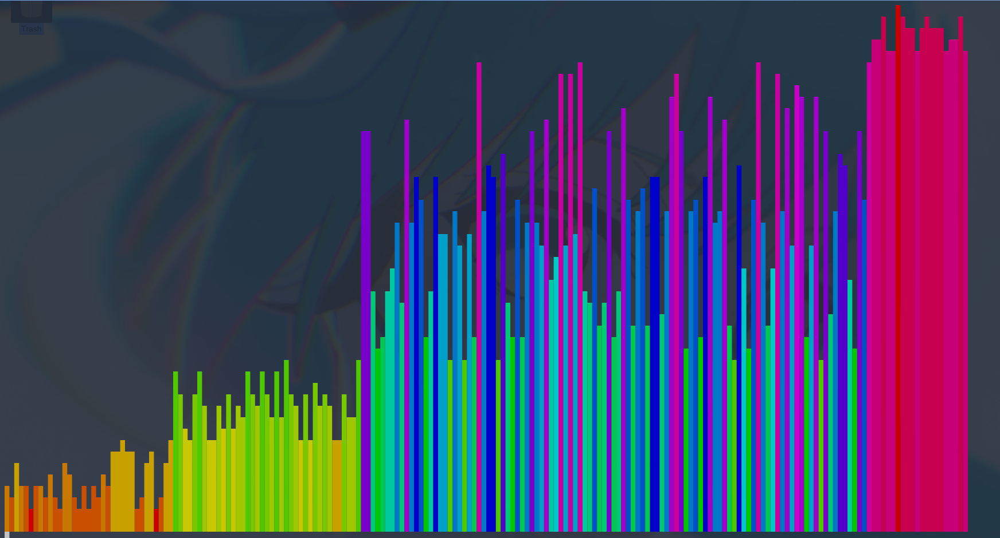
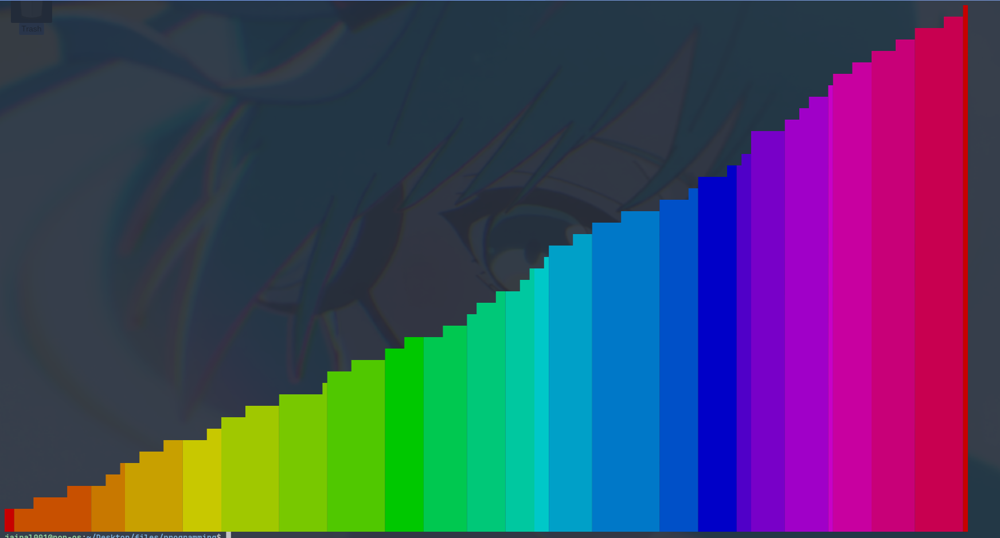
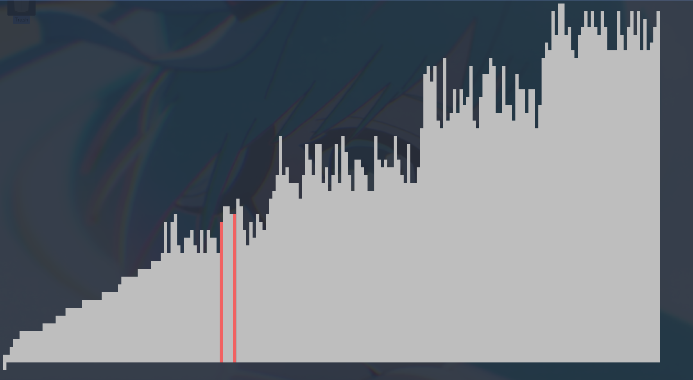
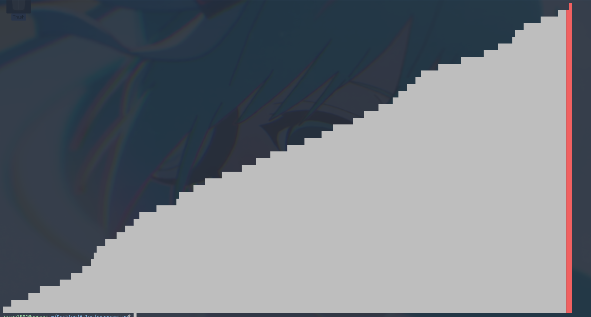

# Programming

## Moving to codeberg [BhJaipal/programming](https://codeberg.org/BhJaipal/programming.git)

## [donuts](./donuts)

Terminal spinning donut

Rotational matrix solved in [donuts/rotational-matrix-calc.txt](./donuts/rotational-matrix-calc.txt)

## Sorting visualize in terminal

visualize sorting algorithms in terminal

main: [visual_sort.c](./visual_sort.c)

```sh
gcc visual_sort.c ./sort_algo.c -lm
```

<div style="display: flex; gap: 8px; flex-wrap: wrap;width: 100%">
  
  
  
  
</div>
<div style="display: flex; gap: 8px; flex-wrap: wrap;width: 100%">
  
  
  
  
</div>

## Pyramid spinning

- 3D spinning pyramid

- src [triangle/](https://codeberg.org/BhJaipal/programming/src/branch/main/triangle)

<video alt="assets/pyramid.mp4" src="https://codeberg.org/BhJaipal/programming/raw/branch/main/assets/pyramid.mp4" style="width: 100%" controls>
</video>

## Donut in OpenGL

- 3D spinning donut in OpenGL and donut calculated by OpenCL

- src [donut-gl/](https://codeberg.org/BhJaipal/programming/src/branch/main/donut-gl)

<video alt="assets/donut.mp4" src="https://codeberg.org/BhJaipal/programming/raw/branch/main/assets/donut.mp4" style="width: 100%" controls>
</video>
